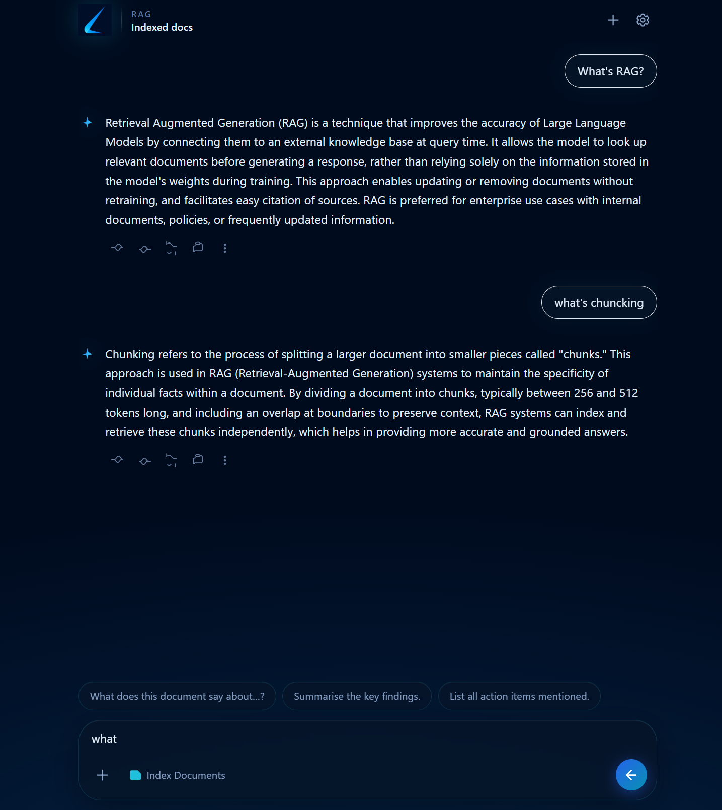

# Chat With Your Data

A small **RAG (Retrieval-Augmented Generation)** demo: upload a **PDF**, index it into a **Chroma** vector store, then **chat** with an **OpenAI** model that answers only from your indexed content.

Repository: [YoussefFathy88/Chat-With-Your-Data](https://github.com/YoussefFathy88/Chat-With-Your-Data)

---

## How it works

The UI lets you **index documents** and **ask questions** against what you uploaded. The flow is: **PDF → chunks → embeddings → Chroma → retrieve similar chunks → GPT-4o answer grounded in context.**



---

## Stack

| Layer | Technology |
|--------|------------|
| Frontend | [Next.js](https://nextjs.org/) 15, React 19, TypeScript, Tailwind CSS |
| Backend | [FastAPI](https://fastapi.tiangolo.com/), [Uvicorn](https://www.uvicorn.org/) |
| RAG | [LangChain](https://www.langchain.com/), [Chroma](https://www.trychroma.com/), OpenAI embeddings + **GPT-4o** |
| Documents | PDF ingestion via PyPDF2 |

---

## Prerequisites

- **Python** 3.11+ (recommended)
- **Node.js** 18+ (for the Next.js app)
- An **[OpenAI API key](https://platform.openai.com/api-keys)** with access to the embedding model and `gpt-4o`

---

## Quick start

### 1. Backend API

```bash
cd backend
python -m venv .venv
```

Activate the virtual environment:

- **Windows (PowerShell):** `.venv\Scripts\Activate.ps1`
- **macOS / Linux:** `source .venv/bin/activate`

```bash
pip install -r requirements.txt
```

Copy `backend/.env.local.example` to `backend/.env.local` (same folder) before editing.

Edit **`backend/.env.local`** and set at least:

- `OPENAI_API_KEY` — your OpenAI secret key

Optional variables (defaults are in `.env.local.example`): Chroma path, collection name, chunk size, overlap, embedding model, retrieval `top_k`.

Start the API (from `backend` with venv active):

```bash
uvicorn app.main:app --reload --host 0.0.0.0 --port 8000
```

- API base: `http://localhost:8000`
- Health: [GET `/health`](http://localhost:8000/health)
- Interactive docs: [http://localhost:8000/docs](http://localhost:8000/docs)

### 2. Frontend

```bash
cd frontend
```

Copy `frontend/.env.local.example` to `frontend/.env.local`, then:

```bash
npm install
npm run dev
```

Open [http://localhost:3000](http://localhost:3000).  
`NEXT_PUBLIC_API_URL` in **`frontend/.env.local`** should point at your API (default `http://localhost:8000`).

---

## Using the app

1. **Index** — Use the in-app control to upload a **PDF**. The backend extracts text, chunks it, embeds it, and stores vectors in Chroma under `CHROMA_PERSIST_DIR` (see `.env.local.example`).
2. **Chat** — Ask questions; answers use retrieved chunks and the configured chat model. If nothing is indexed yet, the API returns a clear message asking you to index first.

Structured logs for indexing and chat may be written under `backend/Logs/` (see `chat_logger` / indexing logger in the codebase).

---

## API overview

| Method | Path | Purpose |
|--------|------|--------|
| `GET` | `/health` | Liveness check |
| `POST` | `/index/` | Multipart upload: PDF file → index into Chroma |
| `POST` | `/chat/` | JSON body: `{ "message": "..." }` or `{ "question": "..." }` → `{ "answer": "..." }` |

CORS is enabled for local Next.js ports (`3000`, `3001`).

---

## Docker (backend only)

From `backend/`:

```bash
docker build -t rag-api .
docker run --env-file .env.local -p 8000:8000 rag-api
```

Ensure `.env.local` exists and contains your secrets before `--env-file`.

---

## License

This project is provided as-is for learning and demonstration. Add a `LICENSE` file if you want to specify terms explicitly.
